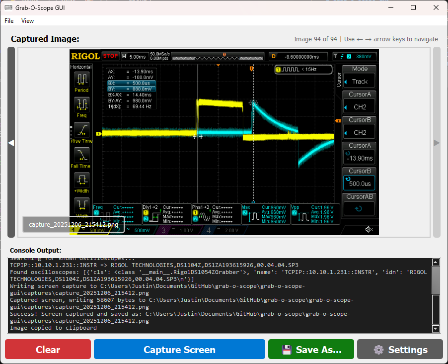

# grab-o-scope-gui
_This is a GUI wrapper for the `grab-o-scope.py` Python script, designed to simplify the process of capturing oscilloscope screen images._

`grab-o-scope-gui` is a Python-based graphical user interface that allows a user to easily capture screenshots and display them. This project serves as a wrapper around the existing `grab_o_scope.py` script, keeping the original functionality intact for future enhancements.



## Features

- **Intuitive GUI** for capturing oscilloscope screen images with real-time console output
- **Device Filtering** by IP address or model name in settings (case-insensitive)
- **Timestamped Captures** saved as `capture_YYYYMMDD_HHMMSS.png` format
- **Image Navigation** with arrow buttons and keyboard shortcuts (← →) to browse through captured images
- **Context Menu Actions**:
  - Copy Image to Clipboard
  - Rename Image
  - Delete Image

## Installation

### Prerequisites

- Python 3.6 or higher
- pip package manager

### 1. Clone the repository

```bash
git clone https://github.com/jwidess/grab-o-scope.git
```

### 2. Install required modules

```bash
pipenv install
```
If not using pipenv,

```bash
pip install -r requirements.txt
```

### 3. Run the application

To start the GUI application, run:

```bash
pipenv run python src/main.py
```

Or without pipenv:

```bash
python src/main.py
```


## Usage

1. **Launch the application** using one of the methods above.
2. **(Optional) Configure Settings** (Settings -> Configure):
   - (Optional) Enter instrument filter (IP address or model name) to target specific scopes
   - (Optional) Change the capture directory (defaults to `./captures`)
3. **Capture Image**: Click the "Capture Screen" button to take a screenshot
   - The application will automatically find the matching device
   - Real time output is shown in the console below
   - Captured image is automatically displayed and saved with timestamp
4. **Navigate Images**: Use arrow buttons or keyboard arrows to browse captures
5. **Image Actions**: Right-click on the displayed image to:
   - Copy Image to Clipboard
   - Rename Image
   - Delete Image


## Development

### Project Structure

```
grab-o-scope-gui/
├── src/
│   ├── main.py                 # Application entry point
│   ├── core/
│   │   ├── config_manager.py   # Configuration management
│   │   └── grabber_wrapper.py  # Wrapper for grab_o_scope.py
│   ├── gui/
│   │   ├── main_window.py      # Main application window
│   │   ├── settings_dialog.py  # Settings configuration dialog
│   │   └── image_viewer_widget.py  # Image display and navigation widget
│   └── utils/
│       ├── helpers.py          # Utility functions
│       └── navigation_manager.py   # Image navigation logic
├── resources/
│   └── icons/                  # Application icons
├── captures/                   # Default directory for saved captures
└── requirements.txt            # Python dependencies
```


## Configuration

The application stores its configuration in `config.json` in the application directory. This includes:
- `instrument_name`: Filter for instrument selection (IP address or model name)
- `capture_directory`: Directory where captures are saved

## Notes


## License

MIT License. See LICENSE file for details.